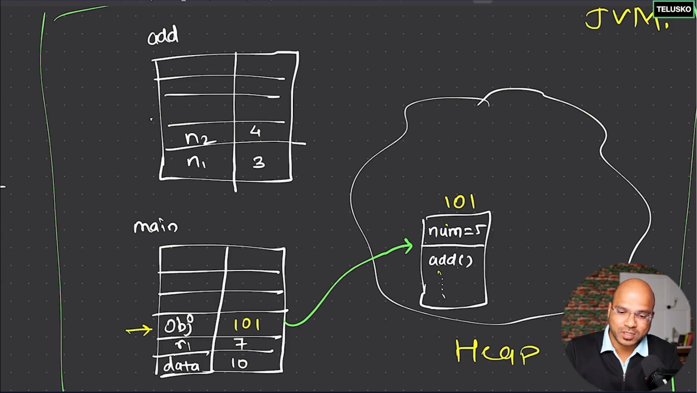
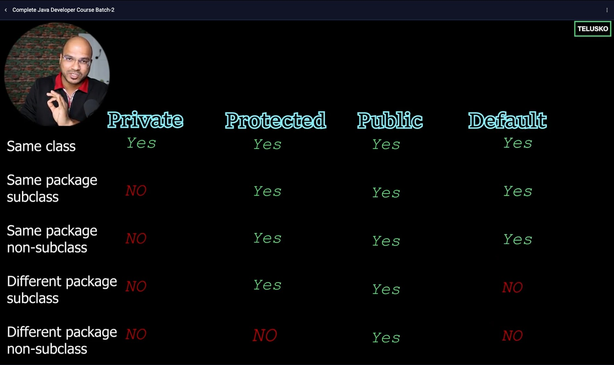

# Java

## Fundamentals of Programming

- A computer is a device that processes data and executes tasks using software programs.
- Different components of the computer: CPU, Hard disk, RAM, Keyboard, Mouse etc.
- Most important component: Processor / CPU, also known as the brain of the computer.
- **Processor** is responsible for any task we perform on this computer.
- Processor is a semi-conductor technology device:
  - It is very fast in its execution
  - Any device which is making use of transistors and capacitors is known as semi-conductor technology device
  - i.e. transistors are being used to make the semi-conductor technology device which is our computer
  - Transistors are of two types: NPN and PNP
  - A transistor can understand only two things: low-voltage (0V) or high-voltage (5V), in software engineering world low-voltage is represented as 0 and high voltage is represented as 1
- Processor is a dumb device, it can't do anything by itself - we have provide instructions to the computer so that it can perform the task for us. But, we have to instruct in the form of 0's and 1's because that the language our processor understands.
- Writing instructions in binary form in a form that the machine understands is known as **Machine Level Language (MLL)**.
- Set of instructions in one place, we call it as **Program**.
- Writing instructions in binary form is not easy and human friendly so we have developed another way of writing instructions that is in the form of mnemonics, which is known as **Assembly Level Language (ALL)**.
- Processor can't understand ALL so we have introduced a system software called **Assembler** which converts ALL, which is in mnemonics to MLL, which is in binary form.
- Because writing programs using ALL is also not so user-friendly as well, so after a lof of research we have come across writing programs using symbols and english like commands, which is known as **High Level Language (HLL)**.
- Processor can't understand HLL as well so we have introduced a system software called **Compiler** which converts HLL, which is in symbols and english like commands to MLL, which is in binary form.

## Memory Unit in a Computer

- CPU can process our instructions and gives us the desired output/result.
- Hard Disk Drive/Device (HDD) is where you can keep your data/instructions which you want to send to your processor to execute and get the desired output.
- To send data from HDD to processor we introduced Bus.
- **Bus** is a set of wires which carries information from one unit to another unit within the system.
- This **HDD** by its very nature, it is very slow compared to processor. Because hard disk drives uses Electro-Mechanical technology (magnetic technology).
- Disadvantages of HDD:
  - Bulky
  - Slow
  - Noisy
- Advantages of HDD:
  - Non-volatile
  - Less costly
- Because we had a speed mismatch between two of the very important components of the computer i.e. HDD and Processor, we introduced another component named as Random Access Memory (RAM).
- **RAM** is built using Semiconductor technology to match the speed of the processor.
- Advantages of RAM:
  - Fast
  - Compact
  - Less noisy
- Disadvantages of RAM:
  - It is a **volatile memory**. Volatile means such a device which requires continuous power supply for the device to work, even if for a fraction of a second if the power supply goes down then all the data will be erased.
  - It is an expensive device.
- The process of storing data from RAM to HDD permanently is known as **Saving**.
- The process of getting the data from HDD to RAM, so that it can further be processed is known as **Loading**.
- **HDD** <--- bus ---> **RAM** <--- bus ---> **PROCESSOR**
- Storage area of the HDD, where we store the data we call it: **File**, storage area of the RAM we call it: **Byte** and the small space where we are executing the instructions on the processor we call it: **Register**.
- RAM is known as main memory, whereas HDD is known as secondary memory.
- The more is the capacity of RAM, the more fast your computer is.
- **Cache Memory**:
  - **CACHE** <--- bus ---> **PROCESSOR**
  - Very small is size: between 2 KB to 20 MB
  - Whenever we have a frequently requested data, in that case OS will allocate that and process it from the cache memory.
  - i.e. if you are opening any file or an image again and again, our processor will be taking the instructions from the cache memory instead of the main memory for processing it.

## Platform and Platform Dependency

- Platform combination of both:
  - Hardware devices of our system
  - Software devices of our system
- Hardware refers to processor and software refers to OS.
- i.e. Intel + Windows is one platform, M2 + MacOS is another platform.
- What is platform dependency:
  - Platform 1:
    - Installed OS: Windows
    - Developed an application using C and when compiled it generates an executable file which is having MLL code with .exe extension
    - Then we upload the executable file (.exe) on the internet
  - Platform 2:
    - Installed OS: Linux
    - Download the executable file which was developed on Windows OS and try to execute it on this platform
    - Execution will fail
  - Platform 3:
    - Installed OS: MacOS
    - Download the executable file which was developed on Windows OS and try to execute it on this platform
    - Execution will fail
  - Platform 4:
    - Installed OS: Windows
    - Download the executable file which was developed on Windows OS and try to execute it on this platform
    - Execution will pass
  - This is known as platform dependency
- If the application development platform has to be same as the application execution platform then we call this a **platform dependent application**
- The primary reason behind this platform dependency is the MLL code generated after compilation of the C program itself is platform dependent.
- Hence, C is a platform dependent language.

## How Java Made Platform Independent Programming Language

- How Java works:
  - Platform 1:
    - Installed OS: Windows
    - Developed an application using Java
    - When compiled the Java application using Java Compiler (javac) it generates **Intermediate Level Language** file known as **Byte code**. Byte code is very very secured and cannot be understood by humans as well
    - We have a component called **Java Virtual Machine (JVM)** which converts the Byte code into Binary (MLL) code
      - JVM is a part of JRE (Java Runtime Environment), which in turn is a part of JDK (Java Development Kit)
      - JVM is a **platform dependent system software** i.e. we have different JVM versions available for different OS - Windows, Linux, MacOS etc)
      - JVM internally makes use of interpreter and converts Byte code into MLL code
      - Then we upload the Byte code on the internet
  - Platform 2:
    - Installed OS: Linux
    - Download the Byte code which was developed on Windows OS and try to execute it on this platform
    - Byte code is platform independent
    - But we need to download the JVM (platform dependent) which is available for Linux OS to convert this file into MLL code
    - Now this time the processor will successfully be able to execute the MLL code without any issue
  - Platform 3:
    - Installed OS: MacOS
    - Download the Byte code which was developed on Windows OS and try to execute it on this platform
    - Byte code is platform independent
    - But we need to download the JVM (platform dependent) which is available for Mac OS to convert this file into MLL code
    - Now this time also the processor will successfully be able to execute the MLL code without any issue
  - This is how Java is made **Platform Independent Language**
- Because we have written the code using Java language in one platform and was able to execute it in multiple different platforms so we call it, **"Write Once, Run Anywhere (WORA)"**
- Java is also called as a **portable** language
- Java is also called as a **architecture-neutral** language

## JDK Setup

- JRE which includes JVM comes preinstalled in most systems. But for development we need JDK which we can download from different vendors.
- Oracle JDK is for commercial use with support
- OpenJDK is for personal use without any additional support
- Recommended IDEs: Eclipse, IntelliJ, VSCode etc.
- Recommended version of Java to install: Java 8, Java 11, Java 17, Java 21 etc. (which has long term support)

## VSCode Setup

- Download link: [https://code.visualstudio.com/download](https://code.visualstudio.com/download)
- Recommended extension:
  - Extension Pack for Java
  - Code Runner

## IntelliJ Setup

- Download link: [https://www.jetbrains.com/idea/download/](https://www.jetbrains.com/idea/download/)

## Eclipse Setup

- Download Link: [https://www.eclipse.org/downloads/packages/](https://www.eclipse.org/downloads/packages/)

## What is Java?

- Java is a programming language which we use to build applications.
- Java is one of the most structured programming languages.
- As per Oracle Java runs on 3.5 billion devices.
- Java Started in 1995 by developed by Sun Micro Systems.
- Java usages: Android apps, BE development of web applications etc.
- Java is a programming language, it is also technology (JVM and some other tools comes as a part of that technology).
- Why JVM is so popular:
  - It makes Java platform independent
  - It makes Java portable
  - We can also run other languages on JVM: Kotlin, Scala and Groovy
- Kotlin is derived from Java, so it's easy jump to Kotlin if we already have knowledge of Java.

## First Code in Java and How Java Works

- **jshell** gives us an interactive playground to learn and experiment with Java programming code in a hassle-free environment.
- Our system's OS works on top of Hardware and JVM works on top of OS.
- JVM is platform dependent, i.e. JVM doesn't have support iOS.
- **Java Code** ---> **Java Compiler** ---> **Byte Code** ---> **JVM** ---> **MLL code**
- Out of all the files in our project, we need to provide JVM the first file from which it should start execution. The first should file have a method called 'main' and with a unique signature `public static void main(String[] args)`.
- Java is an Object Oriented Programming language, which means everything should be an object and to create an object we need to have a class.
- Extension for Java code: .java
- Extension fot the Byte code: .class
- JRE = JVM + Libraries
- JDK = JRE + Other tools
- First Java code:

  ```java
  // Program to print 'Hello World'

  public class FirstCode {
      public static void main(String[] args) {
          System.out.println("Hello World");
      }
  }
  ```

## Variables

- Database is used for permanent storage, but during processing we need to store the data in a temporary place called as variable.
- Java is a strongly typed language, which means every variable, which is going to store some data in Java must have a name and a type associated with it.

## Data Types

- Two category of data types: Primitive and Non-primitive
- Primitive data types are the most simple / basic data types.
- Primitive is also of 4 types:
  - Integer
    - byte -> 1 byte (size) -> -128 to +127 / 2^7 to 2^7 - 1 (range)
    - short - 2 bytes -> 2^15 to 2^15 - 1 (range)
    - int - 4 bytes
    - long - 8 bytes
  - Float
    - float - 4 bytes (size)
    - double - 8 bytes
  - Character
    - char - 2 byte (size) -> Because it stores all types of characters in the word, UNICODE charset
  - Boolean
    - boolean - 1 bit (size)

## Type Conversion

- Storing the value of a lower range data type into a variable of higher range data type is known as widening / implicit conversion.
- Storing the value of a higher range data type into a variable of lower range data type is known as narrowing / explicit conversion / lossy conversion / casting.
- Compiler auto-promotes the type if any operation between two lower range data types evaluates a value which is higher than their individual ranges.
- char to boolean, int to char etc. conversions are not allowed.

## Assignment Operators

- Pre-increment operator: increments the value first and then the value is fetched.
- Post-increment operator: value is fetched first and then the value is incremented.

## Logical Operators

- x > y && a < b: If the first condition evaluates to false it will not check the second condition, and the output will be false.
- x > y || a < b: If the first condition evaluates to true it will not check the second condition, and the output will be true.
- This is when it is known as short circuit.

## Switch Statement

- Whenever the switch statement matches a case it will execute that block and it will also go through all other cases following that block.
- Hence every case block should end with a break statement.

## Loops

- Used to execute a set of instructions multiple times.
- Loops are of 3 Types:
  - while loop: Loop based on a condition, the loop continues to execute until the condition evaluates to false.
  - do-while loop:
    - Similar to while loop, but in this case it executes the body of the loop first and then check for the condition.
    - do-while loop is useful when we want to execute the body of the loop at least once even if the condition is false.
  - for loop:
    - Loop finite no of times, the loop continues to execute may be 5 times, 10 times or even 500 times.
    - In a for loop we can place 3 different statements in one line: initialization, condition and increment/decrement.
    - In the for loop: initialization and condition check will be performed first, then it will execute all the statements which is there in the body of the loop and finally will execute the increment/decrement operation
    - Condition check is the mandatory part of the for loop, while initialization and increment/decrement operations are optional e.g. `for (; i < 5; ) { }`. This can make the for loop look like a while loop.
- If you know how many iterations you want to perform you can use for-loop. If you want to read all the characters of a file, until the EOF is reached using while loop makes sense.

## Class and Object

- Everything around us is an object.
- An object knows something (e.g. has some properties), and does something (e.g has some behaviour or functions).
- In order to create an object we need a class.
- In programming we provide the design of an object in the class file, i.e. we need to create a class file which will act as a blueprint to create the object.
- JVM create the objects in Java.

## JDK vs JRE vs JVM

- JDK
  - Stands for "Java Development Kit".
  - Used to compile the code and convert it to byte code.
  - JRE + One extra layer on top of it = JDK.
  - JDK is mostly installed on developer machines.
- JVM
  - Stands for "Java Virtual Machine".
  - We have a machine and given a virtual layer on top of it so it is called JVM, which used to run the code.
- JRE:
  - Stands for "Java Runtime Environment'.
  - JVM + One extra layer on top of it = JRE.
  - It provides the extra utility classes and files which we have used in our code.
  - It also validates your bytecode.
  - JRE is mostly installed on client machines.

## Method Overriding

- Having methods with same name but with different no parameters or even the type of parameters in a class is known as Method overriding.
- Return type does not matter in Method overriding.
- The only things that matter are:
  - No. of method parameters
  - Method parameter types
- Having same method name to perform different calculations can save the overhead of documentation.

## Stack and Heap

- JVM memory can be categorized in two parts:
  - Stack Memory / Stack Area
    - Area where you can store you data.
    - Based on the LIFO (Last In First Out) principle.
    - Local variables are the part of stack memory.
    - Local variables which includes reference variables will be part of the stack but will point to an address of the object which is stored in heap memory.
  - Heap Memory
    - An open area which can expand.
    - Used to store the objects.
    - Each object will have two items:
      - All the instance variables.
      - All the method declarations (NOTE: actual area which all the methods will consume are of the stack).
- Diagram:  
  

## Arrays

- Arrays are used to store multiple values in one variable.
- Different ways of creation of an integer array:
  - Direct assignment of values:
    - `int[] num = { 5, 6, 7 };`
    - `int num[] = { 5, 6, 7 };`
  - Array creation without initial values:
    - `int num[] = new int[4];`
    - Default value of all the variables will be set to 0.
    - In the statement `new int[4]`, 4 is the size of the array.
- Once you define the size of an array we have to stick with that as we won't be able to change the size of it later.
- Arrays index values starts from 0.
- Size of an array has to be an integer and it can't be negative as well, if we provide a negative size to an array it will throw `NegativeArraySizeException`.
- If you are trying to access an element is equal or greater than the size of the array you will get `ArrayIndexOutOfBoundsException`.
- Multi-dimensional array is also known as array of arrays.
- A jagged array, is a multi-dimensional array structure in which unlike a rectangular or multidimensional array, the inner arrays in a jagged array can have varying lengths, providing flexibility in organizing and representing data with irregular or uneven patterns.
- In a jagged array we specify the no of columns each row is going to hold one by one.

### Drawbacks of an Array

- The array in Java is an object (because we are allocating space in the heap memory using the `new` keyword). An array will occupy continuous memory locations in the heap memory, as a problem once we assign the size of the array we can increase of decrease it. A solution to this problem is create a new array and copy all the elements of the current array to the new array - but that will again consume some time.
- Every time we want to searching something it will traverse between the elements. So for searching or for inserting values in between array consumes a lot of time.
- We cannot store values of different data types in an array.

## String

- String in Java is a class, which represents a bunch of characters together.
- String class objects are immutable in nature, every time you try to change the value of it a new object is created instead of modifying the existing object.
- The following syntax creates the object in String Constant Pool (SCP) area inside heap memory:

  ```java
  String s1 = "Navin";
  String s2 = "Navin";
  System.out.println(s1 == s2);   // true
  ```

- Both the references are pointing to the same object "Navin".
- This optimization technique is used since Strings are used heavily in Java.
- i.e. new references variables will point to existing String objects if the value already exists in SCP area.
- Unreferenced objects will be ready for garbage collection.
- In String class hashCode() method is overloaded so it calculates the output based on their contents and not on their memory addresses.
- The following syntax creates the object in the heap memory:

  ```java
  String s3 = new String("Ashok");
  String s4 = new String("Ashok");
  System.out.println(s3 == s4);   // false
  ```

- Every time a new String object is created.
- To use mutable strings in Java we have to create the objects of StringBuffer and StringBuilder classes.
- StringBuffer is thread-safe, StringBuilder is not.
- Initial capacity of StringBuffer is 16 and it grows by [(initialCapacity * 2) + 2] when the initial capacity is exceeded to accommodate more no of characters.

## Static Keyword

### Static Variable

- The static keyword makes the the variable common to every object.
- Thus a static variable is shared by all the objects.
- static variables should be called with the class name, calling it with the object reference should be avoided.
- We can use the static as well as non-static variables within the non-static method.

### Static Methods

- We cannot use a non-static variable within the static method. This is because non-static variables are a part of the object and not a part of the class.
- main() method is static so that JVM can call it without creating any object of the class.

### Static Block

- Static block is used to initialize the static variables.
- Irrespective of how many objects we have, static block is called only once during the class loading process.
- Object creation has two steps:
  - Class loads
  - Objects are instantiated
- Classes will get loaded from our library to 'Class Loader' which is part of JVM only once.
- Every time you load a class it will call the static block, and since class loading happens first that's why the static block will be called first and then it will create the object during which program flow will call the constructor of the class.
- If we don't create any object, JVM will not load the class as well.
- To load the class without creating any object we can use:  
  `Class.forname("<class_name>");`

### Encapsulation

- Capsule = Something which is kept closed, tight and no one from the outside world can access it.
- e.g. we being a human we have different information stored in our brain, but we may or may expose this to outside world.
- We may decide to expose our name and age, but we may not expose sensitive information like address, phone no or password to someone we don't know to maintain privacy.
- `private` variables are only accessible within the same class.
- Every time we create an instance variable we should make it private. This is because, we should not allow people to access our data directly from outside of the class and provide an indirect way to access the data using getter and setter methods.
- Using getters and setters are basically getting the values using methods and we are also setting the values using methods. Thus, we are binding our data with the methods so that no one from the outside world can access it. This way of encapsulating data with the methods is known as Encapsulation.
- VS Code -> Right click on the class you want to generate getter and setters -> `Source Action` -> `Generate getters and setters` -> Check on the variables and then click on `OK`.

### this Keyword

- `this` is a keyword which represents the current object, the object which is calling the method and is used to point to the instance variable of the class when there is also a local variable present in the method with the same name.

### Constructor

- A constructor is used to initialize the instance variables at the time of object creation.
- A constructor looks like a method itself, the only change is in constructor we don't specify the return type and name of the constructor is same as the class name.
- A constructor is called every time a new object is created.
- Constructor can be of two types:
  - Default constructor
  - Parameterized constructor
- The Java compiler will add a constructor automatically with a blank body when you don't mention any constructor, which is called the default constructor.
- The Java compiler will not add the default constructor if we write our very own parameterized constructor of the class, in that case it is our duty to write the default constructor if required.

### Naming Convention

- Conventions are used to improve readability.
- Java follows a naming convention called Camel casing.
- Class, Enum and Interface name should start with a capital letter.
- Variable and method name should start with a small letter.
- Constants name should contain of all capital letters.
- When a variable name is having multiple words, second word onwards each word's first letter should start with a capital letter.

### Inheritance

- Inheritance is the property by virtue of which a child class can inherit all the properties of a parent class.
- Parent class is also known as base class or super class.
- Child class is also known as derived class or sub class.
- Inheritance helps in code re-useability and removing redundancy.
- For inheritance to work we need the .class file of the parent class, .java file of the parent class is not required.
- Parent child relationship is known as IS-A relationship.
- `extends` keyword is used to inherit the properties of one class to another class.
- Multiple inheritance does not work in Java because;
  - If there is a method with same name and parameters e.g. show() in both the parent classes e.g class A and class B, then child class object will be in ambiguity to call the method from which one of the parent classes.
  - While instantiating the object of child class, compiler in again in ambiguity and does not know which base class constructor to call using super() method.
  - This problem is known as diamond problem.
- If a method with same signature and return type exists in both parent and child classes and we call that method with the child class object, then the behavior of parent class method gets overridden by the child class method. This is called method overriding.

### this() and super() Method

- Every constructor has a implicit method called super() which is by default added by the compiler at the top of all other statements in the constructor.
- super() method is used to call the constructor of the super class, implicit super() call always invokes the default constructor of the parent class.
- Every class in Java, extends the `Object` class.
- this() method will execute the constructor of the same class.

### Packages

- Packages are used to organize Java files by their category and to create a project structure.
- In general whatever class we use in Java belongs to a particular package.
- In Java, there is only one package that gets imported by default in all classes, and that is the java.lang package. This package includes fundamental classes and interfaces closely tied to the language and runtime system. Examples include `Object`, `System`, `String`, `Thread`, `Math`, etc.
- Here's the import statement for this package: `import java.lang.*;`.
- However, you don't need to explicitly import this package in your Java programs, as it's done automatically by the Java compiler.
- In the statement `import java.lang.*;`, `*` refers to all the files (and not folders) present inside `java.lang` package / folder.
- We can make a shareable package name unique by appending your reverse domain name in the beginning of your package name e.g. `package com.mmt.tools.*`.

### Access Modifiers

- Properties and methods with default access modifier can only be accessed within the same package and can't be accessed from outside.
- Hence, if we want something to be accessed outside the packages always make it public and this is why methods most of time they are public.
- Properties and methods with private access modifier can only be accessed within the same class.
- Properties and methods with protected access modifier can only be accessed within the same package or within the sub-class.
- Properties and methods with public access modifier can be used from anywhere.
- Conventions:
  - Sharable classes should be marked public.
  - Variables in most of the cases should be marked private.
  - Methods most of the type should be public, or protected in some rare cases.
  - Try to avoid using default.
- Access modifiers and their scopes:  
  
